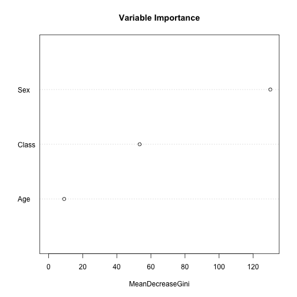

Titanic Survival Prediction
========================================================
author: Brenda Cooney
date: Dec 26th, 2015

Summary
========================================================

- Dataset (Brief into to Titanic Dataset)
- Prediction (Info on Prediction Model Built)
- Graph (Dotchart of variable importance)
- Summary

DataSet
========================================================

'Titanic' dataset in RStudio used. Dataset is converted from a 4-dimensional array into a 'data.frame' using 'expand.table'.It has 2201 observations on 4 variables.

- Class: (1st, 2nd, 3rd, Crew)......Sex: (Male, Female)
- Age: (Child, Adult)...............Survived: (No, Yes)


```
  Class         Sex          Age       Survived  
 1st :325   Male  :1731   Child: 109   No :1490  
 2nd :285   Female: 470   Adult:2092   Yes: 711  
 3rd :706                                        
 Crew:885                                        
```

Prediction
========================================================
Prediction model is created using method 'Random Forest'. **Outcome** variable is 'Survived' and all others are **Predictors**.


```

Call:
 randomForest(formula = Survived ~ ., data = titanic_DF) 
               Type of random forest: classification
                     Number of trees: 500
No. of variables tried at each split: 1

        OOB estimate of  error rate: 21.63%
Confusion matrix:
      No Yes class.error
No  1460  30  0.02013423
Yes  446 265  0.62728551
```

Graphs
========================================================
Dotchart of variable importance as measured by a Random Forest

 

Summary
========================================================

The Prediction Model is deployed to **shionyapps.io**. Any user can come to the site and attempt the prediction by: 
- Selecting **Class**, **Sex**, and **Age** in the lefthand panel.

Survival is predicted in the main section of the page:
- **Yes** implies you would have survived the Titanic based on data selected. **No** implies you would not have survived. 

There will be times that the prediction is incorrect, as the Prediction Model **Accuracy** for the given dataset is:


79.054975%
